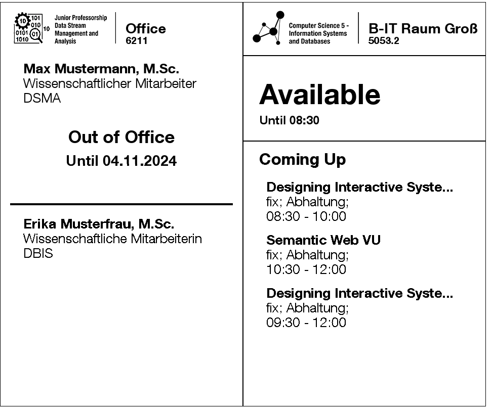
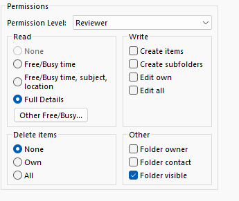
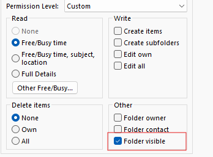
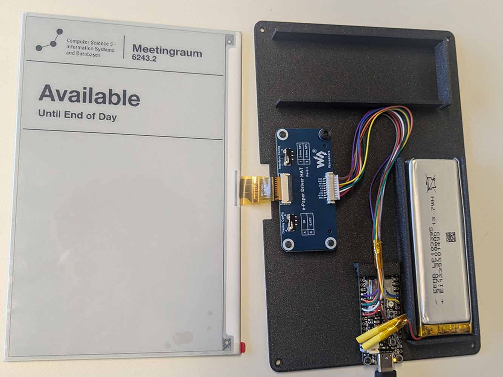
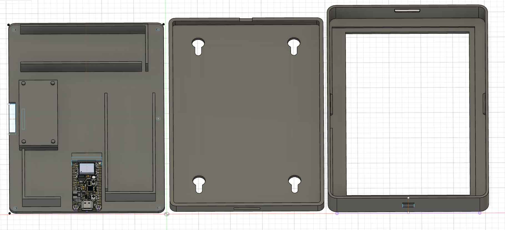

# RoomMate

RoomMate provides digital e-ink signs for bookable resources such as meeting rooms and offices (OfficeMate).
For meeting rooms, your RoomMate displays the current availability (occupied / available), as well as a list of upcoming meetings.
OfficeMates display up to two names and affiliations, as well as potential out-of-office notices.
This project was developed for the infrastructure at RWTH Aachen University, but is configurable to other scenarios.



We currently support room calendars accessible through Microsoft Exchange and published as ical via RWTHOnline.
The calendar information is accessed through a nodejs server component.
The client consists of an eink screen and an esp32 board.
The screen content is processed on the server.
The client regularly requests the server via WiFi and HTTP and updates the screen content.


## Usage
If configured accordingly, the RoomMates for bookable rooms will automatically display the current and upcoming room occupations.
The end users can influence the content by booking the associated resources via Outlook (or RWTH Online).
The displays are battery operated.
If the battery is low and needs to be recharged, the screen will not update anymore and show a low battery warning.
In that case, the RoomMate needs to be charged via the USB-C port.

OfficeMates can be configured by the occupants of that office via their personal calendars.
Please find the details on the necessary configuration below.
If configured accordingly, Out of Office notices are automatically generated if the primary calendar of the associated user in Exchange 
contains a current appointment with  "Show as" set to "Out of Office".
The system will automatically determine the duration and display it as well.

Additionally, the occupants can configure a separate calendar "SIGN" to display custom messages.
If a custom message is set, it overwrites a potential out of office notice from the primary calendar.
For entries in "SIGN", users can set a title and the body of the message.
The message is displayed for the set duration of the appointment.
The location field is ignored.
The first 5 lines of the message body are displayed.
The title should only use 25 characters and each body line should not be longer than 45 characters.
Do not use additional HTML formatting or your message may be displayed wrong.


### Exchange Calendar Setup
If calendars are retrieved from Exchange, the system user used to access the calendars in a domain needs the permission to do so.
For different types of screens, different permissions need to be set.

#### Bookable Room Calendar
For rooms and resources, the system user needs read access to the "Full Calendar Details" (Reviewer).
These permissions can be configured by the room manager via the calendar properties in Outlook.



#### Personal Availability
In the case of offices, each occupant can configure their access individually.
To display Out of Office notices, the system user needs read access to the Free/Busy times.
This is often already set as the Default permission for users in the same domain, so it may not be necessary to set this explicitly.

To display custom messages, a separate calendar needs to be created and named "SIGN".
The system user needs read access to the "Full Calendar Details" (Reviewer) of the "SIGN" calendar.
Additionally, to find this calendar, the system user needs access to "Folder visible" __of the primary (parent) calendar__.



Please note that the display of availability and out of office messages is optional. 
If the necessary permissions are not set, the display will function as a static room sign.


## Server Deployment
For an easy deployment of the server component, we recommend using our Docker image.
You can find an example on a possible docker-compose setup with that image in our [Deployment Examples](server/room-manager/deployment_example).
You can download the example and start the server with `docker compose up -d` after you changed the configuration for your needs.
The image is published as `ghcr.io/liam-tirpitz/roommate/room-manager` (`latest` for releases, `nightly` for the development branch).
The examples mount the whole [config](server/room-manager/deployment_example/config) directory, which contains `calendars.json` and the logos, to `/home/node/app/room-manager/config`, and the logs to `/home/node/app/room-manager/logs`.
Secrets can be placed in an optional `.env` file next to the `file` and `mongo` folders.

Alternatively, you can clone the repository, install node and start the server with

```bash
npm i
npm run build
npm run start
```
Make sure to pass a correct configuration and secrets.
The following environment variables are recognized:
```STORAGE``` can either be set to ```MONGO``` or ```FILE``` (default).
This determines if a MongoDB instance is expected as the storage backend or if a JSON configuration file is used.
Please note, that we currently do not support changing data via the API for the File-Backend.
For details, please check out the [Deployment Examples](server/room-manager/deployment_example).


## Server Configuration
If a file backend is chosen, the configuration of all the rooms, persons, devices and endpoints can be done with the [calendars.json](server/room-manager/deployment_example/config/calendars.json).
For development purposes, this file should be placed inside a config directory in the root of the project.
The configuration file is loaded once when the project is started. 
If the configuration is changed, the server needs to be restarted.

### Room and Device Configuration
Each room is configured with a `tenants` and an `id_string`, which are displayed on the screen.
In addition the affiliation of the room can be shown by using a custom logo from the config directory, indicated via `logo`.
The type of calendar is defined by either defining `ews_info` OR `ical_info` (see below).
Each device consists of a `device_id` (MAC-Address) and a descriptive `location` string.
Rooms are directly associated with the device they are configured for.
If the same room has multiple displays, the room configuration needs to be duplicated.

```json
"devices": [
    {
        "device_id": "aaaaaaaaaaaa",
        "location": "Left_Door",
        "room_id": {
            "room_number": 200,
            "id_string": "200a",
            "name": "Meetingraum",
            "logo": "institute_logo.png",
            "ews_info": {
                "email": "room@domain",
                "tenant_id": 1
            }
        }
    }
]
```

### Office Configuration
In case of offices, at most two people can be defined with independent (Exchange) calendars.
The definition of people can be set instead of an `ews_info` or `ical_info`.
Each person has a `name`, a `job` and a `group`. 
This data is displayed on the screen.
Additionally, each person has an independent `email` and `tenant_id` to retrieve their data through EWS.

```json
"persons": [
    {
        "name": "Max Mustermann, M.Sc.",
        "job": "Wissenschaftlicher Mitarbeiter",
        "group": "DSMA",
        "ews_info": {
            "email": "mustermann@institute.rwth-aachen.de",
            "tenant_id": 1
        }
    }
]
```

### Calendar Configuration
Currently, we can retrieve data from either an Exchange Server, or via ical files.

#### Exchange Configuration
To access data through the Exchange Web Services API (EWS), which is required for rooms, resources and users available in Outlook,
we need to configure access for each exchange domain.
Specifically, we need an endpoint and credentials for a user with the necessary permissions.
This user needs permissions to read the calendars for all entities that we want to map to a display.
Multiple credentials can be stored for users across domains or exchange infrastructures (`tenants`).

```json
"exchange": {
    "tenants": [
      {
        "id": 1,
        "endpoint": "https://ENDPOINT/EWS/Exchange.asmx",
        "user": "USER@DOMAIN",
        "secret": "SECRET"
      }
    ]
}
```

The users can then be mapped to each calendar.
Each exchange tenant requires an `endpoint`, a `user` and a password.
Through the `id`, exchange credentials can be mapped to a specific room or person.
The username of each calendar retrieved through exchange is configured as part of the individual calendar configuration as `email`.
```json
"calendars": [
  {
    ...
    "ews_info": {
      "email": "room@domain",
      "tenant_id": 1
    }
    
  }
]
```

We configure the endpoint and the username in the configuration file.
The passwords are injected at runtime through environment variables (`secret`).


##### Secrets
The configuration key `exchange.tenants.secret` defines the _name_ of the environment variable that is injected.

There are 3 supported ways  to inject the secrets.
First, if a Docker deployment is used is used, 
the secrets can be passed directly to the container, via the [docker-compose.yml](server/room-manager/deployment_example/file/docker-compose.yml).
For development purposes, the variables can be defined in a .env file placed in [server/](server).

Lastly, the secrets can be synchronized via [Bitwarden Secrets Manager](https://bitwarden.com/products/secrets-manager/).
In that case, we need to configure an access token in BWS and configure the environment variable `BWS_ACCESS_TOKEN`.
For this to work locally, you need to install the [Secrets Manager CLI](https://bitwarden.com/help/secrets-manager-cli/).
Local injection via the Secrets Manager can be enabled by using `npm run start_bws` or `npm run dev_bws`
The docker image already contains the CLI tool. 
To enable it, pass the `BWS_ACCESS_TOKEN` environment variable.
If this variable is not present, the secrets should be passed directly via environment variables.


#### ICal Configuration
The ical module only requires a public HTTP endpoint from which the calendar is retrieved.
__Please note, that the current ical implementation is incomplete.__
Calendars from RWTHOnline can be parsed, but more complex structures (especially recurrences) are not yet supported.

```json

"calendars": [
  {
    ...
    "ical_info": {
      "endpoint": "www.domain.de/calendar"
    }
    
  }
]
```
### Logos
We can define different logos for each device.
These logos should be placed alongside the configuration file in the config directory.
These images should be in png format and ideally already black and white. 
If they are colored, the image processing will make them black and white, but this may be less beautiful.
For the correct resolution, please check the [example](server/room-manager/deployment_example/config/institute_logo.png).

## Client

### Hardware
The hardware of the RoomMates consists of a 3D printed case and the electronics.

#### Electronics

The electronics of the RoomMates consist of the following components:
For details, see the [Bill of Material](./hardware/bom.xlsx)

- EInk-Display (7.5 inch, 800x400 black/white module with driver HAT [from Waveshare](https://www.waveshare.com/7.5inch-e-paper-hat.htm))
- ESP32-Microcontroller Development Board ([Adafruit ESP32 Feather V2](https://www.adafruit.com/product/5400))
- 3700 mAh LiPo Battery

The driver HAT connects the E-Ink display to the Microcontroller.
The Feather has built-in LiPo support and directly connects to the battery.


#### Wiring 
The e-ink HAT connector cable need to be soldered to the Feather board, according to the following pinout.
The used pins are defined in [DEV_Config.h](./client/room-occupancy/Room-Occupancy-Client/lib/esp32-waveshare-epd/src/DEV_Config.h)

| E-Ink | Feather   |
|-------|-----------|
| PWR   | 12        |
| BUSY  | 32        |
| RST   | 27        |
| DC    | 33        |
| CS    | 15        |
| CLK   | 5 (SCK)   |
| DIN   | 19 (MOSI) |
| GND   | GND       |
| VCC   | 3V        |


#### Case
The case consists of three parts.
The front cover holds and exposes the eink display, the middle part holds the electronics and the battery and
the backplate holds everything in place and provides mounting holes for hanging the device.
The case was designed in Fusion 360.
We provide the [Fusion project files](./hardware/case/fusion_project_files) and exported [STEP files](./hardware/case/step-files).
In our deployment, we print the case on a Prusa MK4 3D printer with [Prusament PLA in Galaxy Black](https://www.prusa3d.com/de/produkt/prusament-pla-prusa-galaxy-black-1kg/).




### Software
The client software project is developed with [PlatformIO](https://platformio.org/) as the IDE.
The firmware of devices can be flashed via USB.

### Provisioning
To communicate with the server, each RoomMate must be provisioned with WiFi credentials and the server endpoint.
With the Provisioner [Gordon tool](server/room-manager/src/provisioner/gordon.ts) devices can be automatically provisioned, using credentials stored in the Bitwarden Secrets Manager.
For a device with the MAC address "aa:aa:aa:aa:aa:aa", place a secret of the form `PSK_aaaaaaaaaaaa` in the store, connect the RoomMate via USB and execute Gordon.

Alternatively, you can manually use the the CLI via serial at a baud rate of 115200.
The following commands are needed to provision the device.

```bash
wifi.getMAC
wiFi.setCredentials SSID PSK
config.setEndpoint http://SERVER:PORT/
restart
```
